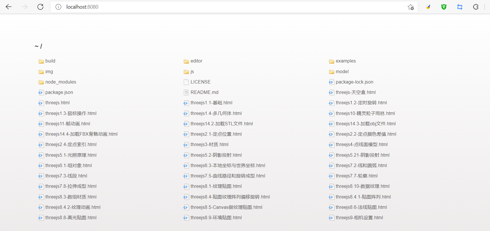

# threejs-learn

 这是学习threejs过程中的练习代码。

学习的原始教程:[Three.js零基础入门教程(郭隆邦)](http://www.yanhuangxueyuan.com/Three.js/)

## 准备

### 安装node环境

- 安装nodejs

这些练习代码是纯HTML和JavaScript代码，要正常运行这些代码需要需要Node.js环境。安装Node环境请参阅[搭建Node环境](https://ldc2.layabox.com/doc/?language=zh&nav=zh-ts-1-0-0) .

- 安装nodejs本地静态服务器

```shell
npm install -g live-server
```

在练习threejs的过程中，往往需要频繁的代码测试，查看threejs代码的渲染效果。这时候你肯定希望代码修改之后，threejs渲染效果立即热更新。如果通过live-server模块搭建的本地静态服务器，你可以实现代码的热加载。也就是说你修改一段代码，然后保存.html代码文件，.html对应的threejs案例就会重新渲染。

### 安装Three.js库

此库中没有包含Three.js的源文件。所以将此库克隆到本地后，需要自行安装Three.js的源文件。

```shell
# 导航到项目克隆后的本地文件夹
cd threejs
# 在此文件夹中安装three
npm install three
```

## 运行本地服务

```shell
# 导航到项目克隆后的本地文件夹
cd threejs
# 启动本地静态服务器
live-server
```

静态服务器启动后，如下图所示：

